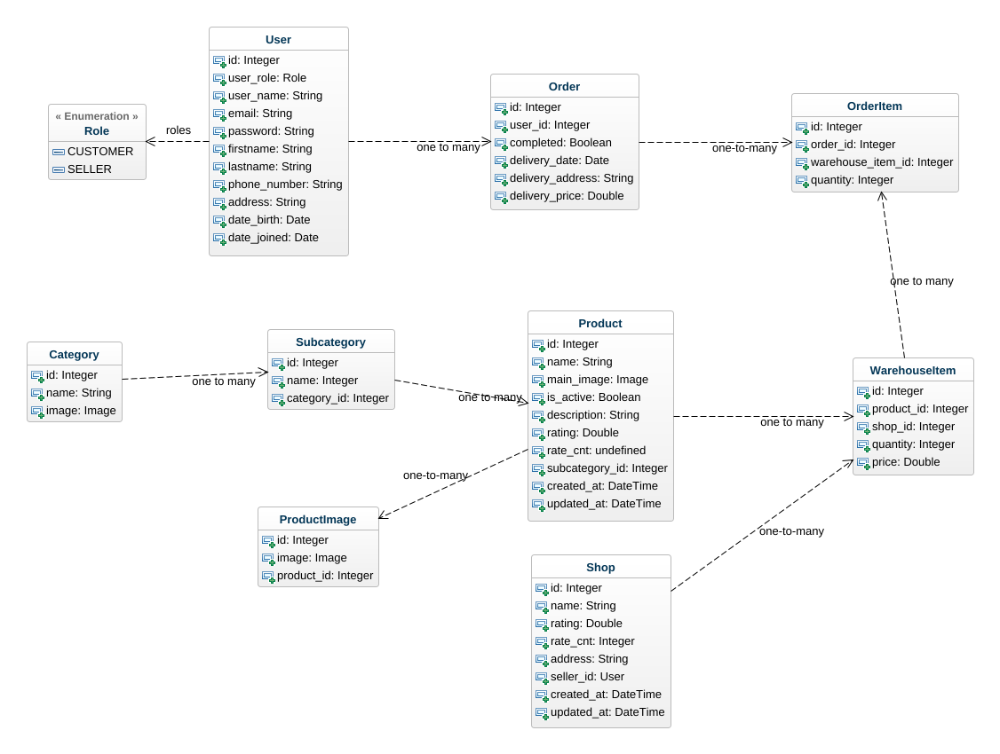

# web application - 1market 

The app is marketplace similar to a kaspi.kz/shop. The application allows sellers to sell their products, create their own shop. Users can purchase items and make orders. App provides features such as a search bar, pagination, and sorting options to help users navigate their content more easily. 

**Technology Stack**

- Django
- Angular
- SQLite

### **Features**

- Some of the main features include:
- User authentication and authorization.
- Create, edit, and delete products, orders, shops.
- Search bar to find products based on keywords
- Pagination to view products.
- Sorting options to order goods by rating, price.
- Responsive design for web browser.

### **Class Diagram**

### **Future Development**
- AI chatbot assistant
- Social sharing options for products and sellers/shops
- Comments section for users to leave feedback
- Advanced search capabilities with filtering options

### **Installation**
 
 To install and run 1market, follow these steps:

#### For backend:

1) Install Python: 1market project requires Python 3.6+ to be installed on your system. You can download Python from the official website (https://www.python.org/downloads/). Choose the version of Python that matches your operating system and follow the installation instructions.

2) Install pip: pip is the package installer for Python. Once you have Python installed, you should have pip automatically installed. You can check if pip is installed by running the following command in your terminal or command prompt: pip --version. If pip is not installed, you can install it by following the instructions on the official website (https://pip.pypa.io/en/stable/installing/).

3) Create and activate a virtual environment: It's a good practice to create a virtual environment for each project to avoid conflicts with other packages on your system. Navigate to the root directory of the project and run the following commands to create and activate a virtual environment:

On macOS and Linux:

bash
Copy code
python3 -m venv env
source env/bin/activate
On Windows:

bash
Copy code
python -m venv env
env\Scripts\activate.bat
Install Django: Once you have activated the virtual environment, you can install Django by running the following command in your terminal or command prompt: pip install Django. This will download and install the latest stable version of Django.

4) Clone the repository: Clone the 1market repository to your local machine using Git or download the zip file and extract it to a local directory.

5) Migrate the database: Navigate to the root directory of the project and run the following command to apply any pending database migrations: python manage.py migrate.

6) Create a superuser (optional): If you want to access the Django admin panel, you'll need to create a superuser. Run the following command and follow the prompts: python manage.py createsuperuser.

7) Run the development server: Finally, start the development server by running the following command: python manage.py runserver. You should see a message indicating that the server is running. Open a web browser and navigate to http://localhost:8000 to view the project.

8) That's it for back side! You should now have 1market installed and running on your local machine with a virtual environment. If you encounter any issues during the installation process, please refer to the Django documentation.

####For frontend:

To install and run angular, follow these steps:

1) Install Node.js: MyAngularProject requires Node.js to be installed on your system. You can download Node.js from the official website (https://nodejs.org/en/download/). Choose the version of Node.js that matches your operating system and follow the installation instructions.

2) Install the Angular CLI: Once you have Node.js installed, you can install the Angular CLI by running the following command in your terminal or command prompt: npm install -g @angular/cli. This will download and install the latest version of the Angular CLI globally.

3) Clone the repository if you didn't clone: Clone the MyAngularProject repository to your local machine using Git or download the zip file and extract it to a local directory.

4) Install project dependencies: Navigate to the root directory of the project and run the following command to install the project dependencies listed in the package.json file: npm install.

5) Run the development server: Finally, start the development server by running the following command: ng serve. You should see a message indicating that the server is running. Open a web browser and navigate to http://localhost:4200 to view the project.

That's it! You should now have 1Market installed and running on your local machine. If you encounter any issues during the installation process, please refer to the Angular documentation.

